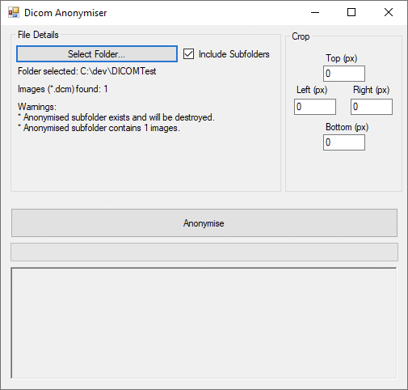

# DicomAnon
Anonymizes DICOM files.  Removes all personal identifiers from the DICOM file and assigns a new Study Instuance UID.  If information is burned onto the image, the user can crop a set number of pixels from the top, bottom, left and right sides for all images in the batch.  Creates an output folder with the anonymized DICOM files (\*.dcm), an 8-bit PNG copy (\*.png), a 16-bit TIFF file (\*.tif), and an index file (Map.csv) that maps the original Study Instance UID and filename to the new ones.

## Development environment
- Created using Microsoft Visual Studio Community 2019 version 16.4.5 targetting .NET Framework 4.6.1.

## Packages
- fo-dicom v4.0.0
- fo-dicom.Desktop v4.0.0

May not work with more recent versions of fo-dicom.

## Screenshot

